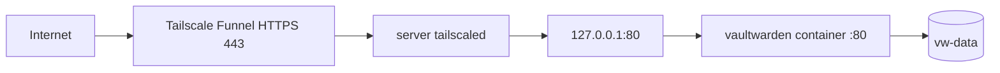

# Vaultwarden with Host Tailscale Funnel

Vaultwarden runs in Docker on local HTTP. The server's own Tailscale daemon terminates HTTPS on port `443` and proxies to Vaultwarden on `127.0.0.1:80`.

## Architecture



## Prerequisites

- Docker and Docker Compose installed.
- Tailscale installed and logged in on the server.
- MagicDNS, HTTPS, and Funnel enabled for the tailnet.
- A Funnel policy grant for the server/user.

## Configure

```bash
cp .env.sample .env
```

Set these values in `.env`:

```bash
DOMAIN=https://ser.taile9f91c.ts.net
ROCKET_PORT=80
HOST_HTTP_PORT=80
SIGNUPS_ALLOWED=false
INVITATIONS_ALLOWED=false
WEBSOCKET_ENABLED=true
SHOW_PASSWORD_HINT=false
```

Leave `ADMIN_TOKEN` commented out to disable the admin panel. Generate one only if you need `/admin`:

```bash
docker run --rm -it vaultwarden/server:latest /vaultwarden hash --preset argon2id
```

## Start Vaultwarden

```bash
docker compose up -d --remove-orphans
curl -I http://127.0.0.1:80/
```

The compose file binds `127.0.0.1:${HOST_HTTP_PORT}:80`, so Vaultwarden is not exposed directly on the LAN.

## Enable Funnel

Run this on the server that has host Tailscale installed:

```bash
tailscale status
tailscale funnel --bg --https=443 http://127.0.0.1:80
tailscale funnel status
```

Then test:

```bash
curl -I https://ser.taile9f91c.ts.net/
```

If server port `80` is already used, set `HOST_HTTP_PORT=8080`, restart Vaultwarden, and point Funnel at `8080`:

```bash
docker compose up -d
tailscale funnel --bg --https=443 http://127.0.0.1:8080
```

## Auto Start

Docker already restarts the container with `restart: unless-stopped`. If you want systemd to re-run Compose after Docker starts:

```bash
./install-systemd-service.sh
```

Check it with:

```bash
systemctl status vaultwarden-tailscale-local-setup.service --no-pager
```

## Operations

```bash
docker compose ps
docker compose logs vaultwarden
docker compose pull
docker compose up -d
```

Turn Funnel off:

```bash
tailscale funnel --https=443 off
```

Reset Funnel config:

```bash
tailscale funnel reset
```

## Backup

```bash
./backup.sh
```

Back up at minimum:

- `vw-data/`
- `.env`
- `docker-compose.yml`

Host Tailscale state now lives outside this project, usually under `/var/lib/tailscale`.

## Fresh Start

This deletes Vaultwarden user/vault data:

```bash
docker compose down
sudo rm -rf ./vw-data/*
rm -rf ./vw-logs/*
docker compose up -d
```

## Files

```text
.
├── docker-compose.yml
├── .env.sample
├── install-systemd-service.sh
├── backup.sh
├── redeploy.sh
├── vw-data/
└── vw-logs/
```
